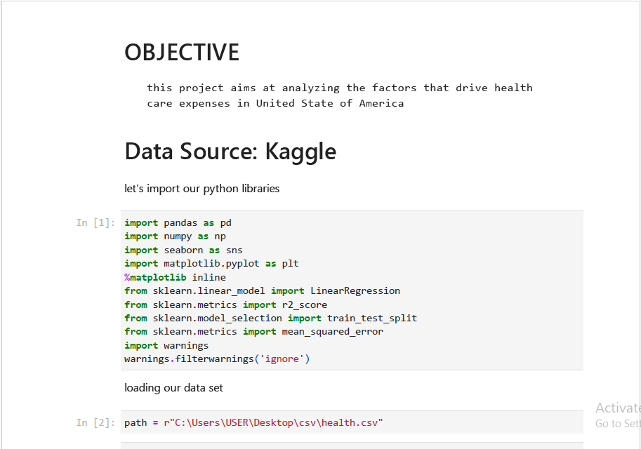

# Medical Cost Analysis & Linear Regression Using Python

## Project Overview

This project analyzes medical insurance costs using Python and applies a Linear Regression model to understand the key factors that influence healthcare expenses.

The project covers the complete data analysis workflow, including data exploration, data cleaning, exploratory data analysis (EDA), feature encoding, model development, and model evaluation.

---

## Project Objective

The objective of this project is to identify the major factors that influence medical insurance charges and evaluate the performance of a Linear Regression model.

---

## Dataset

**Source:** Kaggle

The dataset contains **1,338 records** and **7 features**, including:

- Age
- Sex
- BMI (Body Mass Index)
- Number of Children
- Smoker Status
- Region
- Medical Charges (Target Variable)

---

## Tools & Libraries

- Python
- Pandas
- NumPy
- Matplotlib
- Seaborn
- Scikit-learn
- Jupyter Notebook

---

## Project Workflow

### Data Loading

- Imported the dataset into Jupyter Notebook.

### Data Understanding

- Examined the dataset structure.
- Reviewed data types.
- Checked dataset dimensions.
- Generated descriptive statistics.

### Data Cleaning & Preprocessing

- Checked for missing values.
- Encoded categorical variables.
- Prepared the dataset for machine learning.

### Exploratory Data Analysis (EDA)

- Explored relationships between variables.
- Visualized important patterns using charts.

### Model Development

- Split the dataset into training and testing sets.
- Built a Linear Regression model.

### Model Evaluation

The model performance was evaluated using:

- R² Score
- Mean Absolute Error (MAE)
- Mean Squared Error (MSE)
- Root Mean Squared Error (RMSE)

---

## Key Findings

- Smoking status is one of the strongest predictors of medical insurance charges.
- Age and BMI also have a significant impact on healthcare costs.
- The Linear Regression model explains a large proportion of the variation in medical charges using the selected features.

---

## Repository Contents

- Medical Cost Analysis & Linear Regression Using Python.ipynb
- Medical Cost Analysis & Linear Regression Using Python.pdf
- health.csv
- Medical-Cost-Analysis.png

---

## Future Improvements

- Compare Linear Regression with other machine learning algorithms.
- Perform feature engineering.
- Improve model performance through hyperparameter tuning.
- Build an interactive dashboard for data visualization.

---

## Author

**Abdulmalik Ibrahim Ozovehe**

**Founder, AIM Analytics**

Website: https://aimanalytics.carrd.co

LinkedIn: https://www.linkedin.com/in/aimanalytics
